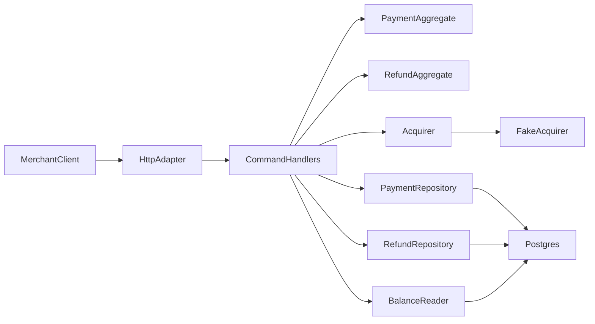
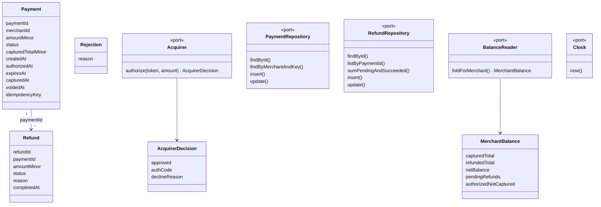
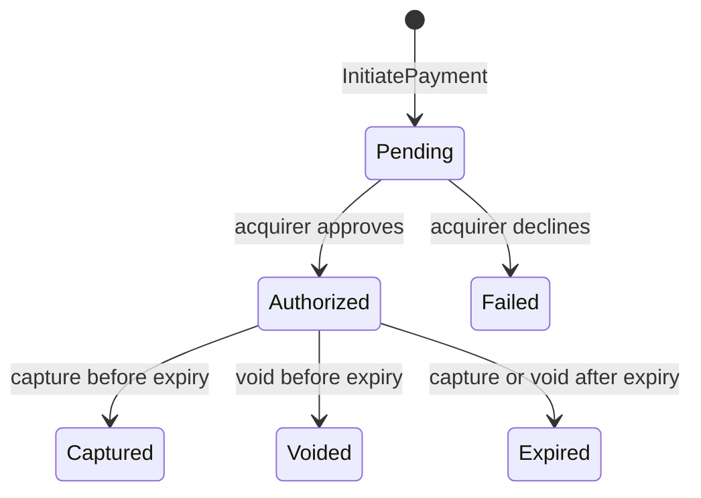
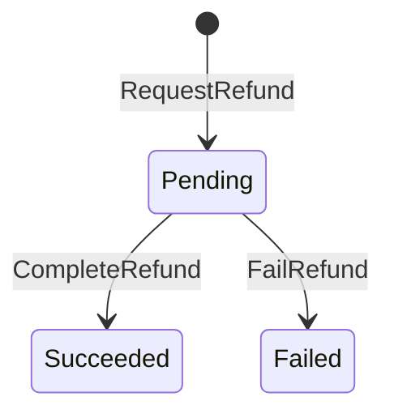
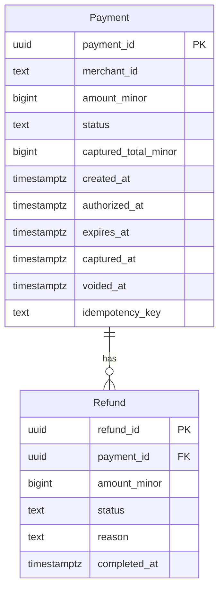
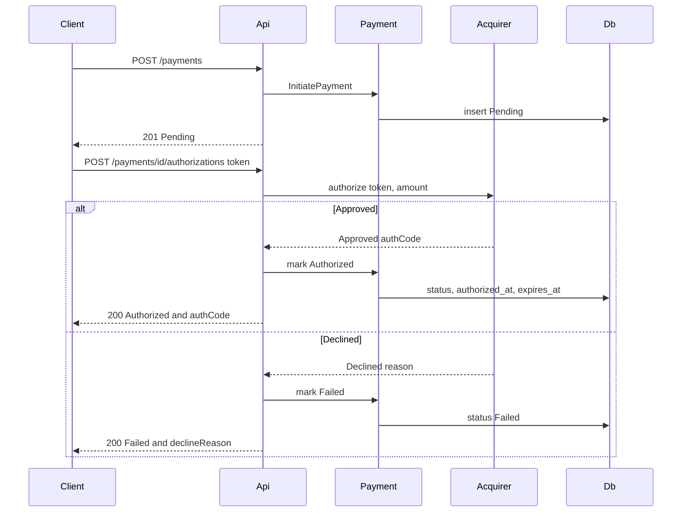
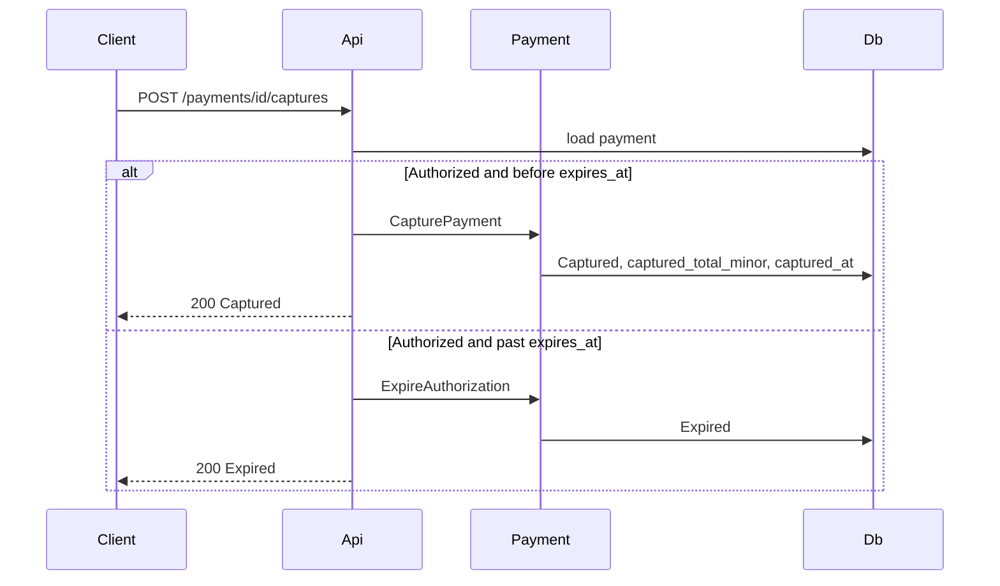
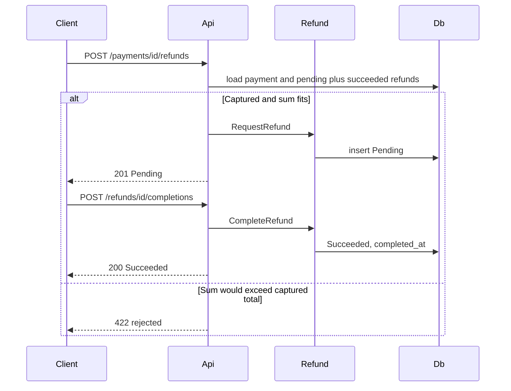
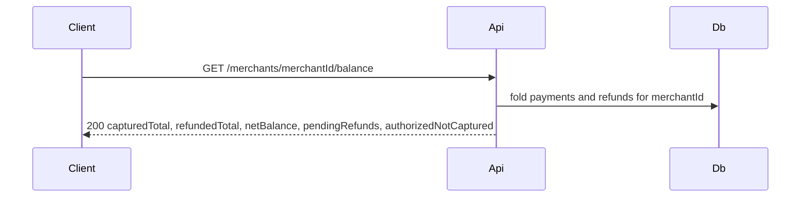

# Payment processor design

Source: [Toy Payment Processor Specification](https://cyberdash.atlassian.net/wiki/spaces/CYBERDASH/pages/5013506/Toy+Payment+Processor+Specification). One service implements both aggregates. Postgres stores current state. The merchant balance is folded from that state on read.

## Service boundary

One deployable, `pmts-api`, owns both aggregates. Payment and Refund stay separate domain models inside that service. They share one database because `RequestRefund` must read `captured_total_minor` and the refund rows together. A second service would split that check across a network call without a reservation column to make it atomic. The tolerated race from BR-12 stays inside this one service.

The shape is ports and adapters:

- Driving adapter: HTTP, the merchant-facing API below. The existing `/health` and `/health/db` routes stay. The local React client in `web/` calls this API.
- Application: one handler per command. Handlers load aggregates, call the domain, and save. A rejection is a return value with a reason, not a thrown exception.
- Domain: `Payment` and `Refund` aggregates, money as integer USD cents, and the status enums. Aggregates enforce their own transitions.
- Driven ports: `Acquirer`, `PaymentRepository`, `RefundRepository`, `BalanceReader`, and `Clock`.
- Driven adapters: `FakeAcquirer` (`tok_ok` approves; `tok_insufficient`, `tok_declined`, and `tok_bad` decline), Postgres repositories, and the system clock.

Layout under `api/src`: `domain/`, `application/`, `ports/`, `adapters/http/`, `adapters/postgres/`, `adapters/acquirer/`. `api/src/server.ts` composes the adapters and starts Express.

## Domain model

`Payment` is the aggregate root. Its identity is `paymentId`, a UUID. `idempotencyKey` is unique only together with `merchantId`. It is a retry lookup, not the identity.

`Refund` is its own aggregate. Its identity is `refundId`, a UUID. It stores `paymentId` so a refund can be completed or failed without treating the refund as an entity inside the payment.

`MerchantBalance` is a projection, not an aggregate and not a stored table. Money is integer USD cents. There is no currency field.

Application handlers, one command each:

- `InitiatePayment`
- `AuthorizePayment`
- `CapturePayment`
- `VoidPayment`
- `GetPayment`
- `RequestRefund`
- `CompleteRefund`
- `FailRefund`
- `GetBalance`

Domain operations return either the next aggregate or a `Rejection`. They do not throw for a business rule failure.

## Domain behavior

Payment statuses: `Pending`, `Authorized`, `Captured`, `Voided`, `Expired`, `Failed`. `Authorized` is the only status with outgoing transitions. The others are terminal.

Refund statuses: `Pending`, `Succeeded`, `Failed`.

`InitiatePayment` inserts `Pending`. It does not call the acquirer. Authorization is a later command. The token and the auth code exist only on that authorization request. Neither is stored. A decline reason is the transition from `Pending` to `Failed`. It is returned on that response and is not a column. The payment status `Expired` is the separate transition from `Authorized` when the window has passed.

Amounts are USD cents. There is no currency column. A refund uses the payment's cents. `refunds.reason` is free text.

When authorization succeeds, `authorized_at` is now and `expires_at` is `authorized_at` plus `AUTHORIZATION_WINDOW_DAYS` (default 7). That period is environment configuration. `authorized_at` and `expires_at` stay null while the payment is `Pending` or `Failed`.

A capture or void whose payment is `Authorized` and past `expires_at` runs expiry instead. The status becomes `Expired`, and the capture or void does not proceed. Capture is allowed only while `Authorized` and before `expires_at`. One capture is final, including a partial capture. The uncaptured remainder is released. `captured_total_minor` is the amount taken. `captured_at` is set on capture. `voided_at` is set on void.

`RequestRefund` requires a `Captured` payment. It sums pending and succeeded refunds and rejects the command when the new amount would exceed `captured_total_minor`. Two concurrent requests can both pass that read. That race is accepted. There is no reservation column. `FailRefund` drops its amount out of the sum. `CompleteRefund` does not change the sum. `completed_at` is set when a refund leaves `Pending`.

Repeating an idempotency key for the same merchant returns the original payment and inserts nothing. A unique-key collision on insert is treated the same way: read the existing row and return it.

## Database

`db/init/02-domain.sql` creates the domain tables. `db/init/01-init.sql` stays the bootstrap marker. The new file is registered in `db/kustomization.yaml`. Compose mounts `db/init`. Init runs only on an empty data volume.

`payment_id` and `refund_id` are `uuid primary key default gen_random_uuid()`. `refunds.payment_id` references `payments(payment_id)`.

Constraints and indexes:

- `payments.amount_minor > 0`
- `payments.captured_total_minor >= 0` and `payments.captured_total_minor <= payments.amount_minor`
- `payments.status` in `Pending`, `Authorized`, `Captured`, `Voided`, `Expired`, `Failed`
- `refunds.status` in `Pending`, `Succeeded`, `Failed`
- `refunds.amount_minor > 0`
- unique `(merchant_id, idempotency_key)`
- index `refunds(payment_id)` and `payments(merchant_id)` for the balance fold

`created_at` is set on insert. `captured_at`, `voided_at`, and `completed_at` stay null until those transitions.

There is no `merchant_balances` table and no event log. For one `merchant_id`, the read fold is:

- `capturedTotal` sums `captured_total_minor` where status is `Captured`
- `refundedTotal` sums refund `amount_minor` where status is `Succeeded`
- `pendingRefunds` sums refund `amount_minor` where status is `Pending`
- `authorizedNotCaptured` sums payment `amount_minor` where status is `Authorized`
- `netBalance` is `capturedTotal` minus `refundedTotal`

Payments in `Failed`, `Voided`, or `Expired` contribute nothing.

## API

All bodies are JSON. Money fields are integer cents. A domain rejection is HTTP 422 `{ "rejected": true, "reason": "..." }`. An acquirer decline is HTTP 200 with `status: "Failed"` because a decline is a recorded outcome. Unknown ids are HTTP 404. An invalid UUID is also 404. The authorize response may include `declineReason` or `authCode`. Later GETs omit both, because they are not stored.

`POST /payments`

- Body: `{ "merchantId", "amountMinor", "idempotencyKey" }`
- Creates `Pending`. Same merchant and key returns the existing payment and HTTP 200. A new payment is HTTP 201.

`POST /payments/{paymentId}/authorizations`

- Body: `{ "token" }`
- Calls `Acquirer.authorize(token, amount)`. `Approved` moves the payment to `Authorized` and returns the payment plus `authCode`. `Declined` moves it to `Failed` and returns the payment plus `declineReason`.

`POST /payments/{paymentId}/captures`

- Body: `{ "amountMinor" }` optional. Omitted means capture the full authorized amount. Present means a partial capture with `0 < amountMinor <= amount_minor`.
- Success is HTTP 200 and status `Captured`. Past `expires_at`, the payment becomes `Expired` and the body is the expired payment.

`POST /payments/{paymentId}/voids`

- Empty body. Success is HTTP 200 and status `Voided`. Past `expires_at`, the payment becomes `Expired` instead.

`GET /payments/{paymentId}` returns the stored payment. `GET /payments/{paymentId}/refunds` returns its refunds.

`POST /payments/{paymentId}/refunds`

- Body: `{ "amountMinor", "reason" }`
- Requires `Captured` and a passing BR-12 check. HTTP 201 and status `Pending`.

`POST /refunds/{refundId}/completions` moves `Pending` to `Succeeded`. `POST /refunds/{refundId}/failures` moves `Pending` to `Failed`. Both return HTTP 200 and set `completed_at`.

`GET /merchants/{merchantId}/balance` runs the fold and returns `capturedTotal`, `refundedTotal`, `netBalance`, `pendingRefunds`, and `authorizedNotCaptured`.

`GET /health` reports that the process is up. `GET /health/db` reports that Postgres answered a query.

Rejection reasons include `AmountMustBePositive`, `MerchantIdAndIdempotencyKeyRequired`, `TokenRequired`, `PaymentNotPending`, `PaymentNotAuthorized`, `CaptureAmountOutOfRange`, `PaymentNotCaptured`, `RefundExceedsCapturedTotal`, `RefundNotPending`, `PaymentNotFound`, and `RefundNotFound`.

## Request flows

Initiate, then authorize. The token is on the second request only.

Capture and void. After the window, either command expires the payment.

Void uses the same branch: `Voided` when the window is open, `Expired` when it has passed.

Refund request, then complete or fail. BR-12 is the read before insert.

`POST /refunds/{refundId}/failures` follows the completion path and stores `Failed`.

Balance is a read. No write, no event replay.

## Left out of the system

No merchant, customer, or instrument tables. No currency column. No stored token, auth code, or decline reason. No refund reservation column. No event log and no stored merchant balance. Real card data, 3-D Secure, disputes, payouts, and webhooks stay out of scope, as in the specification.
